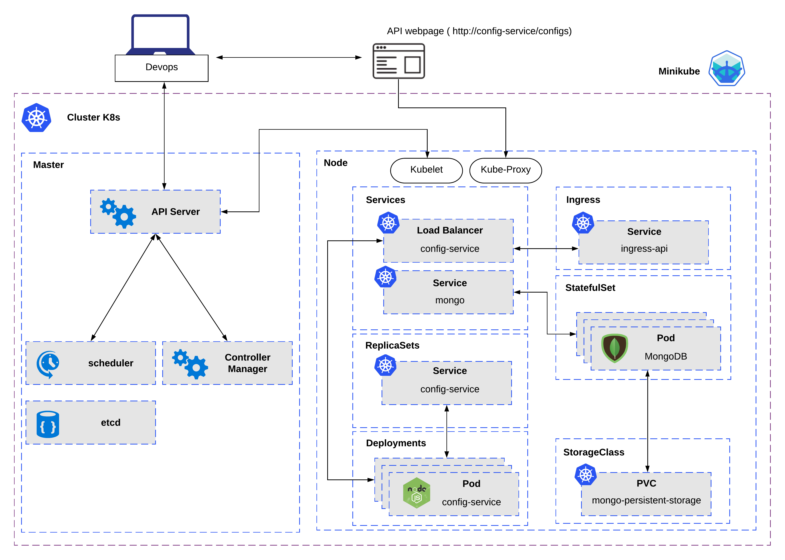
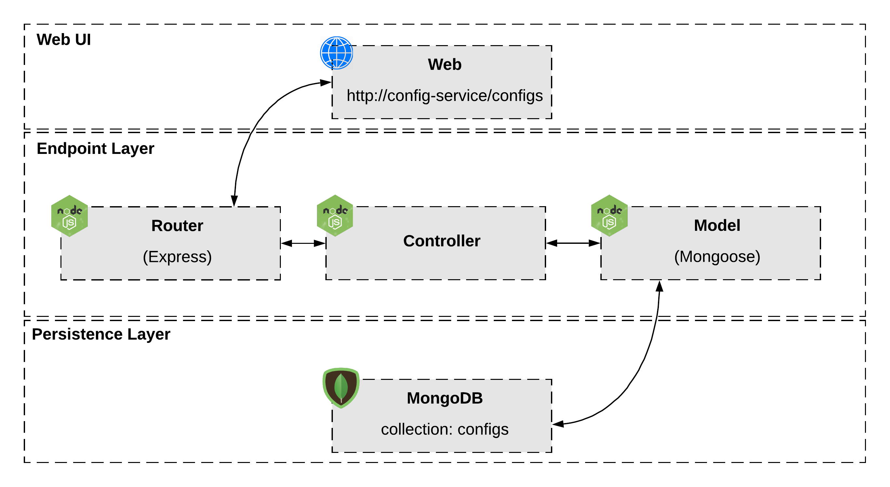

# A Kubernetes cluster managing a REST API with Node.js, Express and MongoDB.

Web API implementation (DevOps Test).
Could be improved in many ways: CI, automated performance tests & more.


## Prerequisites

- **Docker**
- **Minikube**

Note: Please make sure dns 'config-service' is not fixed for any IP on /etc/hosts.

## Setup and Teardown

``` bash
# Deploy the cluster
./scripts/deploy.sh

# Teardown the cluster
./scripts/teardown.sh
```

## Tasks

| Task         | Description                               |
|--------------|-------------------------------------------|
| start        | Starts the API                            |
| start:dev    | Starts the API and watches for changes    |
| test         | Runs the unit/integration tests           |
| test --watch | Runs the tests in watch mode              |

# Architecture overview

### Minikube diagram



### API diagram



### Components

  - **NodeJS**: Node.js is an open-source, cross-platform, JavaScript runtime environment that executes JavaScript code outside of a browser.
  - **MongoDB**: MongoDB is a cross-platform document-oriented database program. Classified as a NoSQL database program, MongoDB uses JSON-like documents with schema.
  - **Docker**: Docker is a set of platform as a service products that use OS-level virtualization to deliver software in packages called containers.
  - **Minikube**: Minikube implements a local Kubernetes cluster on macOS, Linux, and Windows.

### Tech stack/libraries

- [Express](https://github.com/expressjs/express)
- [Mongoose](https://github.com/Automattic/mongoose)
- [Cors](https://github.com/expressjs/cors)
- [Body-parser](https://github.com/expressjs/body-parser)
- [Dotenv](https://github.com/motdotla/dotenv)
- [http-status-codes](https://github.com/prettymuchbryce/http-status-codes)
- [jest](https://github.com/facebook/jest)

### Endpoints

Following are the endpoints implemented and your respective controller:

| Name   | Method      | URL                                | Controllers
| ---    | ---         | ---                                | ---     
| List   | `GET`       | `/configs`                         | `listAllConfigs`
| Create | `POST`      | `/configs`                         | `createConfig`
| Get    | `GET`       | `/configs/{name}`                  | `getConfigByName`
| Update | `PUT/PATCH` | `/configs/{name}`                  | `updateConfig`
| Delete | `DELETE`    | `/configs/{name}`                  | `deleteConfig`
| Query  | `GET`       | `/search?metadata.key=value`       | `searchConfigs`

### Manifests

  - **ingress-api.json**: Ingress to provide load balancing and redirect DNS for our API service. 
  - **api-config-service-deployment-ru.json**: Deployment to provides Rolling updates and ReplicaSets for our API Pods.
  - **api-config-service-svc.json**: Service to expose our API running on a set of Pods as a network service.
  - **mongo-svc.json**: Service to expose our database running on a set of Pods as a network service.
  - **mongo-statefulset.json**: StatefulSet to provide a deployment and scaling of a set of Pods, and provides guarantees about the ordering and uniqueness of these Pods.
  - **mongo-storage.json**: StorageClass to provide a stable and persistent storage for our database.

## Directory structure

```sh
.
├── docs # Documentation (e.g diagrams)
├── manifests # manifests files to deploy k8s cluster
├── scripts # application scripts (e.g deploy.sh teardown.sh)
└── api-config-service
    ├── tests # unit/integration tests using jest
    └── src
        ├── controllers #Defines our business logic
        ├── models # Database models schema
        └── routes # Express route controllers for all the endpoints of the API
        
```
